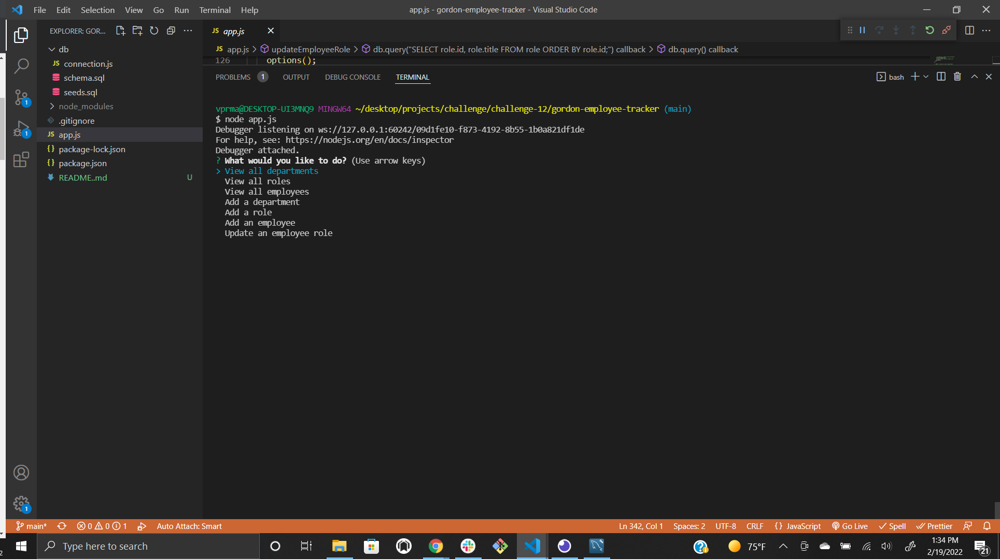
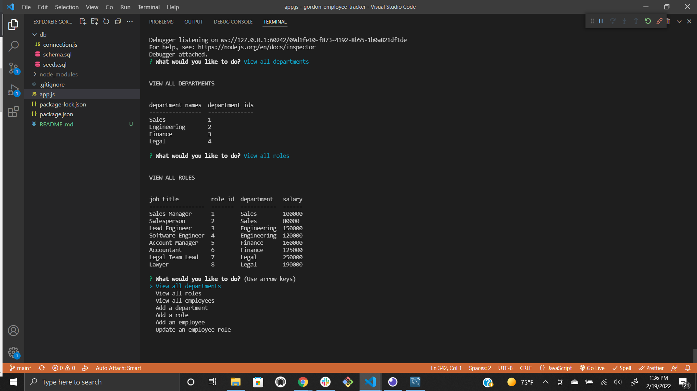
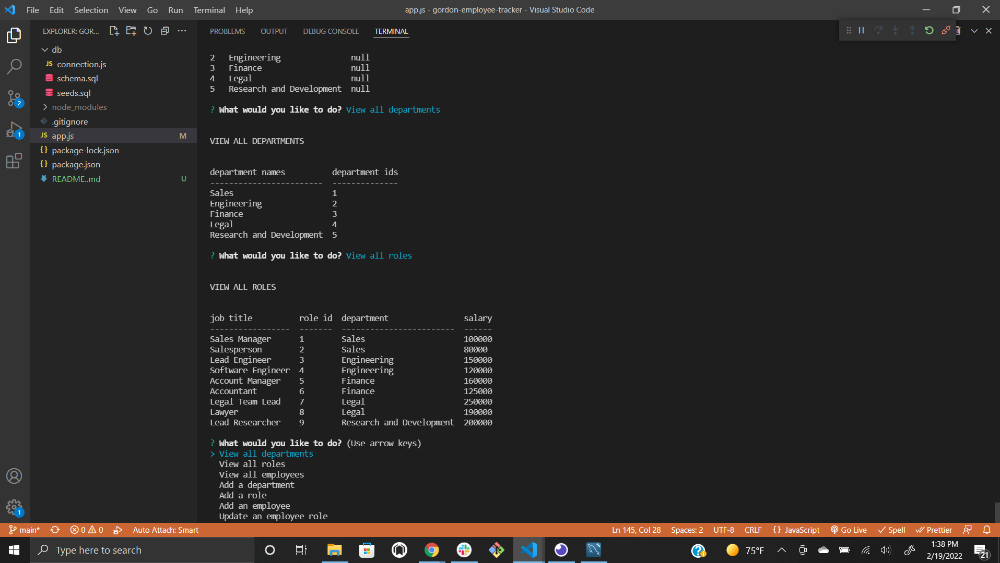

# Gordon Employee Tracker

## Description

Command line application that accepts user input to view and manage departments, roles, and employees

## Table of Contents

*[Installation](#installation)

*[Usage](#usage)

*[License](#license)

*[Contributing](#contributing)

*[Tests](#tests)

*[Questions](#questions)

## Installation

From the command line, run npm init to ensure all dependencies are loaded, then run node app.js

## Usage

The application will present you with action choices.  Simply select the appropriate task and follow the prompts.  The result will be either a populated table that can be viewed in the terminal, or an updated table.  

Check out this [video walkthrough](https://youtu.be/Amdyegthn68) to see it in action!

## License
This application is covered under the [MIT](./License/MIT.txt) license.
  
## Contributing

Pull requests are welcome. For major changes, please open an issue first to discuss what you would like to change.

## Tests

The application has been tested for all actions and verified through mysql queries.  Check out some screenshots of the app in action

## Questions

If you have any questions, please contact me by [email](mailto:vprmatrix55@gmail.com) or through [Github](https://github.com/Mike2481)

